# AGENTS.md

> Architectural specification, operational invariants, and execution reference for AI coding agents and core contributors working on the `prompter` codebase.

---

## 1. Overview & Core Invariants

`prompter` is a focused Go CLI tool that transforms rough prompt text, unstructured notes, and fragmented ideas into production-grade AI prompts. It also provides offline deterministic image prompt assembly, Markdown restructuring, prompt output validation, and an interactive Bubble Tea fuzzy finder across local prompt vaults.

### Non-Negotiable Engineering Principles
- **Unix Composability**: Clean, machine-usable prompt output is written strictly to `stdout`. Progress spinners, debug logs, timing metrics, and dry-run diagnostics go exclusively to `stderr`.
- **Fail Fast, Fail Loud**: Never introduce silent fallbacks, magic defaults that mask missing credentials, or silent error suppression. If configuration is missing or an API error occurs, exit immediately with a distinct non-zero exit code (`1` for errors, `130` for `SIGINT`).
- **Zero-Touch Startup**: Operates without an initial configuration file using Google Application Default Credentials (ADC) plus a Google Cloud project environment variable for Gemini, or standard provider environment variables (`OPENAI_API_KEY`, `GROQ_API_KEY`, etc.).
- **Offline First Where Applicable**: Image prompt construction (`image`) executes 100% offline without remote network requests.
- **Portable Configuration**: Any generated or saved `~/.config/prompter/config.json` uses portable `~` paths (e.g. `"prompts_dir": "~/.config/prompter/prompts.d"`), dynamically expanded at runtime on macOS, Linux, and Windows.

---

## 2. Capabilities & Subcommand Map

| Command | Usage | Description | Input Source |
|---------|-------|-------------|--------------|
| *(no args)* | `prompter` | Prints usage on an interactive terminal; piped input without an explicit command is rejected. | None |
| `refine` | `prompter refine <context>` | Improves rough prompt input using the active LLM provider. | Positional args, `--file`, or piped stdin |
| `critique` | `prompter critique <prompt>` | Analyzes flaws, ambiguities, and missing constraints without rewriting. | Positional args, `--file`, or piped stdin |
| `rewrite` | `prompter rewrite --file notes.md --mode clean` | Cleans, organizes, and restructures rough Markdown and documentation. | Positional args, `--file`, or piped stdin |
| `apply` | `prompter apply <name-or-alias> [input]` | Applies a catalog prompt by exact name or alias; strips frontmatter and uses prompt body as system prompt. | Positional args, `--file`, or piped stdin |
| `browse` | `prompter browse` | Launches the Bubble Tea prompt browser across local prompt directories. Selection is copied to clipboard and emitted to `stdout`. | Interactive TTY |
| `image` | `prompter image <subject>` | Builds a detailed image-generation prompt from local modular components; it does not generate an image. | Offline / Positional args |
| `configure` | `prompter configure` | Launches the TUI configuration wizard, or displays resolved non-secret config when non-interactive. | Interactive TTY / redirected output |
| `models` | `prompter models refresh` | Refreshes the cached Models.dev catalog and prints the top affordable choices per provider. | Network (Models.dev + OpenRouter + local OMLX) |
| Global flags | `prompter --help` / `prompter --version` | Prints root help or version/build information. | None |

---

## 3. Configuration & Precedence Hierarchy

Settings are resolved using a strict precedence order:
`CLI Flags > Environment Variables > ~/.config/prompter/config.json > Built-in Defaults`

### Configuration Keys & Environment Variables

| Config JSON Field | Environment Variable | Default Value | Purpose |
|-------------------|----------------------|---------------|---------|
| `provider` | `PROMPTER_PROVIDER` | `gemini` | Active LLM provider backend |
| `prompt_file` | `PROMPTER_PROMPT_FILE` | `""` (uses embedded default) | Custom enhancement system prompt file |
| `prompts_dir` | `PROMPTER_PROMPTS_DIR` | `~/.config/prompter/prompts.d` | Primary prompt directory for finder and catalog execution |
| `prompts_dirs` | `PROMPTER_PROMPTS_DIRS` | `["~/.config/prompter/prompts.d", "~/.config/roles/prompts"]` | List of prompt scan directories |
| `components_file` | `PROMPTER_COMPONENTS_FILE` | `~/.config/prompter/components.json` | JSON component library for image assembly |
| `effort` | `PROMPTER_EFFORT` | `low` | Reasoning effort level (`low`, `medium`, `high`) |
| `timeout` | `PROMPTER_TIMEOUT` | `60` | Request timeout in seconds (streaming enforces min `180`s) |
| `max_output_tokens` | `PROMPTER_MAX_OUTPUT_TOKENS` | `4096` | Max tokens generated in completion |
| `max_retries` | `PROMPTER_MAX_RETRIES` | `3` | HTTP retry attempts on transient network/API failures |
| `default_copy` | `PROMPTER_DEFAULT_COPY` | `false` | Automatically copy non-streamed results to system clipboard |
| `<provider>.api_key` | `<PROVIDER>_API_KEY` or `PROMPTER_<PROVIDER>_API_KEY` | `""` | Provider authentication API key |
| `<provider>.key_env` | `PROMPTER_<PROVIDER>_KEY_ENV` | `""` | Custom env var name containing the API key constant |
| `<provider>.model` | `<PROVIDER>_MODEL` or `PROMPTER_<PROVIDER>_MODEL` | Provider default | Default model identifier override |
| `<provider>.base_url` | `<PROVIDER>_BASE_URL` or `PROMPTER_<PROVIDER>_BASE_URL` | Provider default | Custom API endpoint override |

### Provider-Specific Conventions
- **`gemini`**: Uses Google Cloud Vertex AI `GenerateContent` with Application Default Credentials (ADC) by default. Vertex requires `gemini.project_id` or `PROMPTER_GEMINI_PROJECT_ID`, `GEMINI_PROJECT_ID`, `GOOGLE_CLOUD_PROJECT`, or `GCP_PROJECT`; `gemini.location` defaults to `global`. The Google AI Studio endpoint is used when `gemini.base_url` points at `generativelanguage.googleapis.com`, in which case `GEMINI_API_KEY` is sent as `x-goog-api-key`; an AIza key alone does not switch the default Vertex endpoint off ADC.
- **`openai`**: Uses the OpenAI Responses API with `Instructions` for system prompt separation.
- **`chat providers` (`cerebras`, `deepseek`, `groq`, `openrouter`, `zai`)**: Standard Chat Completions API with structured `{role: "system"}` and `{role: "user"}` payloads.
- **`omlx`**: Connects to local Apple MLX server (`http://127.0.0.1:8000/v1`) with default model `Ornith-1.5-35B-A3B-oQ4e-mtp`.

---

## 4. Codebase Architecture Map

```
prompter/
├── main.go                     # Entry point, CLI orchestration, flag parsing, signal handling
├── cli_flow.go                 # Flag interspersing (interspersedFlagArgs) & prompt resolution
├── cli_metadata.go             # Usage output, discovery commands (config, styles, providers)
├── config_tui.go               # Interactive Huh/BubbleTea TUI configuration wizard
├── finder.go                   # Bubble Tea interactive weighted fuzzy finder
├── prompts.go                  # Recursive prompt scanning, YAML frontmatter parser
├── components.go               # Offline image prompt assembler and component statistics
├── rewrite.go                  # Markdown restructuring modes (clean, academic, code, etc.)
├── output_validation.go        # Deterministic & semantic output validator with retry loop
├── init.go                     # Starter-vault seeding with exclusive create (no overwrite)
├── model_catalog.go            # Models.dev catalog fetch/cache; `models refresh` and configure choices
├── embed.go                    # Embedded FS bindings for default prompts & styles
├── internal/
│   ├── config/
│   │   ├── config.go           # Viper config loader, serializer, path expand/unexpand
│   │   └── config_test.go      # Config resolution and portability unit tests
│   └── provider/
│       ├── provider.go         # Provider interface, Chat & OpenAI client wrappers, Registry
│       ├── gemini.go           # Vertex AI & AI Studio client implementation
│       └── provider_test.go    # Provider payload characterization & registry unit tests
├── doctests/
│   ├── finder_test.go          # Asserts finder documentation matches implementation
│   ├── flags_test.go           # Asserts flags and defaults documentation accuracy
│   └── providers_test.go       # Asserts registered provider list consistency
├── evals/
│   └── enhance/                # Source-bound enhancement eval harness (runner, fixtures, manifest)
└── prompts/                    # Embedded markdown prompt templates and styles
```

---

## 5. Execution & Data Flow

```mermaid
flowchart TD
    Start([CLI Invocation]) --> ParseArgs[Parse CLI Args & Flags via interspersedFlagArgs]
    ParseArgs --> LoadConfig[Load Config: CLI > Env > config.json > Defaults]
    
    LoadConfig --> CheckMode{Which explicit command?}
    
    CheckMode -- "No command" --> PrintHelp[Print Usage Help to stderr]
    CheckMode -- "browse (Interactive TTY)" --> FinderFlow[Show Bubble Tea Finder]
    FinderFlow --> ScanPrompts[Scan prompt dirs for .md files]
    ScanPrompts --> FuzzySearch[Weighted Fuzzy Search & Select]
    FuzzySearch --> OutputFinder[Copy to Clipboard + Print to stdout]
    
    CheckMode -- "configure (Interactive TTY)" --> ConfigTUI[Run Huh Config Wizard]
    ConfigTUI --> SaveConfig[Save ~/.config/prompter/config.json with portable ~ paths]

    CheckMode -- "models refresh" --> ModelsFlow[Fetch Models.dev + OpenRouter + local OMLX]
    ModelsFlow --> PrintModels[Print affordable model choices to stdout]

    CheckMode -- "image" --> AssembleFlow[Image Prompt Construction]
    AssembleFlow --> LocalComponents[Combine Local Components in Memory]
    LocalComponents --> OutputResult[Write to stdout / --output / Clipboard]
    
    CheckMode -- "refine / critique / rewrite / apply" --> LLMFlow[LLM Pipeline]
    LLMFlow --> ResolvePrompt[Resolve System Prompt & Mode/Style]
    ResolvePrompt --> ResolveProv[Resolve Provider from Registry & Validate Keys]
    ResolveProv --> ReadInput[Read Input: args / --file / stdin max 1MB]
    ReadInput --> DryRunCheck{--dry-run?}
    
    DryRunCheck -- Yes --> PrintDryRun[Print Resolved Config & System Prompt to stderr]
    DryRunCheck -- No --> StreamCheck{--stream?}
    
    StreamCheck -- Yes --> StreamCall[prov.StreamCall: Stream tokens to stdout]
    StreamCheck -- No --> UnaryCall[prov.Call: Show Stderr Spinner]
    UnaryCall --> ValidateCheck{Output Validation Declared?}
    
    ValidateCheck -- Yes (Invalid & Retries Left) --> RetryCall[Append Violations to Prompt & Retry Call]
    ValidateCheck -- Yes (Valid) / No --> OutputResult
```



### Data Transformations
1. **Input Normalization**: Ingests CLI args, stdin, or file paths up to a hard ceiling of 1 MB (`readLimited`).
2. **Context Assembly**: Combines system prompts (embedded templates or custom catalog files) with user input into a unified `provider.CallRequest{Model, SystemPrompt, UserPrompt, Effort}`.
3. **Payload Formatting**:
   - **OpenAI**: Encoded for OpenAI Responses API with `Instructions`.
   - **Gemini**: Encoded for Vertex AI `GenerateContent` using a Google ADC bearer token, or for the AI Studio endpoint (`generativelanguage.googleapis.com`) using `x-goog-api-key`.
   - **Chat Completions**: Standard JSON payload with `{role: "system", content: ...}` and `{role: "user", content: ...}`.
4. **Output Routing**:
   - Streamed or buffered prompt text is written strictly to `stdout` or `--output`.
   - Progress spinners, diagnostics, and metrics are written to `stderr`.
   - System clipboard is populated via `atotto/clipboard` when `--copy` or `default_copy: true` is active.

---

## 6. Testing, Verification & Operational Invariants

### Development & Verification Commands
Always verify changes across all test packages before committing:

```bash
# Build local binary
go build -o prompter .

# Run all unit tests (use GOWORK=off if parent go.work exists)
GOWORK=off go test -count=1 ./...

# Run documentation consistency tests
GOWORK=off go test -count=1 ./doctests/...

# Static analysis and formatting
go vet ./...
gofmt -l .
```

### Operational Rules for Agents
1. **Doctest Compliance**:
   - `doctests/finder_test.go` asserts that `docs/finder.md` explicitly documents stdout behavior using phrases like `Stdout`/`printed to stdout`.
   - `doctests/flags_test.go` asserts required flag documentation in `docs/flags.md`.
   - `doctests/providers_test.go` asserts that all registered provider names (`cerebras`, `deepseek`, `gemini`, `groq`, `omlx`, `openai`, `openrouter`, `zai`) are documented in `docs/providers.md` and `AGENTS.md`.
2. **Flag Interspersing**: After the explicit command, positional arguments and command-owned flags can appear in any order (e.g. `prompter refine "prompt text" -p openai -s concise`). Flag parsing logic in `cli_flow.go` uses `interspersedFlagArgs`.
3. **Output Validation Protocol**: When catalog prompts declare validation frontmatter, `prompter apply` enforces length ratios, sentence bounds, and optional LLM semantic evaluation. Streaming is strictly disallowed for validated prompts.
4. **Mandatory Neutral Commit Guidance (Zero-Beacon Policy)**: Commit subjects and bodies must be completely standard, boring, and neutral engineering descriptions (Conventional Commits format). Never hype, sensationalize, or broadcast security, vulnerability, credential, or secret-related concerns.
   - **No Telltale / Alarmist Phrasing**: Never use phrases like "security fix", "critical vulnerability", "prevent credential leak", "remove secret", "scrub internal term X", "fix private project leak", or "patch security flaw". These act as neon beacons inviting attackers or researchers to audit git history.
   - **Always Frame as Standard Capability / Maintenance**: Describe only the resulting capability, architectural change, or configuration parameterization (e.g. use `refactor(config): parameterize provider options` instead of `fix: remove hardcoded project id and secrets`; use `refactor(styles): standardize system prompt style resolution` instead of `refactor: remove internal term X`).
