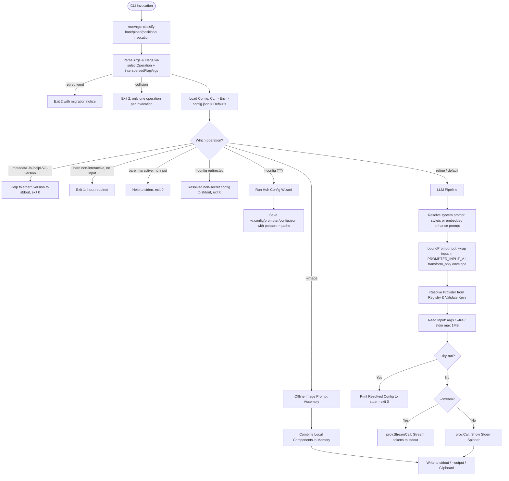

# AGENTS.md

> Architectural specification, operational invariants, and execution reference for AI coding agents and core contributors working on the `prompter` codebase.

---

## 1. Overview & Core Invariants

`prompter` is a focused Go CLI that turns rough prompt material into production-grade AI prompts. It exposes exactly three operations: enrichment (the default invocation, also reachable as the explicit `refine` command word), offline deterministic image-prompt assembly (`--image`), and configuration (`--config`). All earlier subcommands (`critique`, `rewrite`, `apply`, `browse`, `models refresh`, `prompts status|upgrade`, plus the old `image` and `configure` command words) are removed and return migration errors with exit code 2.

### Non-Negotiable Engineering Principles
- **Unix Composability**: Clean, machine-usable prompt output is written strictly to `stdout`. Progress spinners, debug logs, timing metrics, dry-run diagnostics, and help text go exclusively to `stderr`.
- **Fail Fast, Fail Loud**: Never introduce silent fallbacks, magic defaults that mask missing credentials, or silent error suppression. If configuration is missing or an API error occurs, exit immediately with a distinct non-zero exit code (`1` for errors, `2` for usage/migration errors, `130` for `SIGINT`).
- **Single Operation Per Invocation**: `--image` and `--config` cannot be combined, an operation flag cannot be mixed with `refine`, and `--config` rejects positional input; every collision exits 2. A bare non-interactive invocation with no input exits 1 ("input required"); on an interactive terminal it prints help.
- **Zero-Touch Startup**: Operates without an initial configuration file using Google Application Default Credentials (ADC) plus a Google Cloud project environment variable for Gemini, or standard provider environment variables (`OPENAI_API_KEY`, `GROQ_API_KEY`, etc.).
- **Offline First Where Applicable**: Image prompt construction (`--image`) and configuration (`--config`) execute 100% offline without remote network requests. `--config` never fetches a model catalog to open its form.
- **Portable Configuration**: Any generated or saved `~/.config/prompter/config.json` uses portable `~` paths (e.g. `"prompts_dir": "~/.config/prompter/prompts.d"`), dynamically expanded at runtime on macOS, Linux, and Windows. Prompter never modifies or deletes pre-existing files under `~/.config/prompter` beyond the files it owns.

---

## 2. Capabilities & Operation Map

| Operation | Invocation | Description | Input Source |
|-----------|------------|-------------|--------------|
| Enrichment (default) | `prompter [input]` | Improves rough prompt input using the active LLM provider. | Positional args, `--file`, or piped stdin |
| Enrichment (explicit) | `prompter refine [input]` | Identical path to the default form; the only command word. | Positional args, `--file`, or piped stdin |
| Image assembly | `prompter --image [subject]` | Builds detailed image-generation prompts from local modular components; it does not generate an image. | Offline / Positional args, `--file` |
| Configuration | `prompter --config` | Launches the TUI configuration wizard on an interactive terminal, or displays resolved non-secret config when output is redirected. | None (positional input rejected) |
| Global flags | `prompter --help` / `prompter --version` | Prints root help or version/build information to stderr/stdout respectively. | None |

**Removed operations**: `critique`, `rewrite`, `apply`, `browse`, `models refresh`, `prompts status|upgrade`, and the retired `image`/`configure`/`config` command words. Typing any of them prints a migration notice pointing at the replacement (where one exists) and exits 2 without contacting a provider. A retired word placed after `--` is literal input to enrichment.

---

## 3. Configuration & Precedence Hierarchy

Settings are resolved using a strict precedence order:
`CLI Flags > Environment Variables > ~/.config/prompter/config.json > Built-in Defaults`

### Configuration Keys & Environment Variables

| Config JSON Field | Environment Variable | Default Value | Purpose |
|-------------------|----------------------|---------------|---------|
| `provider` | `PROMPTER_PROVIDER` | `gemini` | Active LLM provider backend |
| `prompt_file` | `PROMPTER_PROMPT_FILE` | `""` (uses embedded default) | Custom enhancement system prompt file |
| `prompts_dir` | `PROMPTER_PROMPTS_DIR` | `~/.config/prompter/prompts.d` | Configured prompt directory |
| `prompts_dirs` | `PROMPTER_PROMPTS_DIRS` | `["~/.config/prompter/prompts.d", "~/.config/roles/prompts"]` | List of configured prompt directories |
| `components_file` | `PROMPTER_COMPONENTS_FILE` | `~/.config/prompter/components.json` | JSON component library for image assembly |
| `effort` | `PROMPTER_EFFORT` | `low` | Reasoning effort level (`low`, `medium`, `high`) |
| `timeout` | `PROMPTER_TIMEOUT` | `60` | Request timeout in seconds (streaming enforces min `180`s) |
| `max_output_tokens` | `PROMPTER_MAX_OUTPUT_TOKENS` | `4096` | Max tokens generated in completion |
| `max_retries` | `PROMPTER_MAX_RETRIES` | `3` | HTTP retry attempts on transient network/API failures |
| `default_copy` | `PROMPTER_DEFAULT_COPY` | `false` | Automatically copy non-streamed results to system clipboard |
| `<provider>.api_key` | `<PROVIDER>_API_KEY` or `PROMPTER_<PROVIDER>_API_KEY` | `""` | Provider authentication API key |
| `<provider>.key_env` | `PROMPTER_<PROVIDER>_KEY_ENV` | `""` | Custom env var name containing the API key constant |
| `<provider>.model` | `<PROVIDER>_MODEL` or `PROMPTER_<PROVIDER>_MODEL` | Provider default | Default model identifier override |
| `<provider>.base_url` | `<PROVIDER>_BASE_URL` or `PROMPTER_<PROVIDER>_BASE_URL` | Provider default | Custom API endpoint override |

### Provider-Specific Conventions
- **`gemini`**: Uses Google Cloud Vertex AI `GenerateContent` with Application Default Credentials (ADC) by default. Vertex requires `gemini.project_id` or `PROMPTER_GEMINI_PROJECT_ID`, `GEMINI_PROJECT_ID`, `GOOGLE_CLOUD_PROJECT`, or `GCP_PROJECT`; `gemini.location` defaults to `global`. The Google AI Studio endpoint is used when `gemini.base_url` points at `generativelanguage.googleapis.com`, in which case `GEMINI_API_KEY` is sent as `x-goog-api-key`; an AIza key alone does not switch the default Vertex endpoint off ADC.
- **`openai`**: Uses the OpenAI Responses API with `Instructions` for system prompt separation.
- **`chat providers` (`cerebras`, `deepseek`, `groq`, `openrouter`, `zai`)**: Standard Chat Completions API with structured `{role: "system"}` and `{role: "user"}` payloads.
- **`omlx`**: Connects to local Apple MLX server (`http://127.0.0.1:8000/v1`) with default model `Ornith-1.5-35B-A3B-oQ4e-mtp`.

---

## 4. Codebase Architecture Map

```
prompter/
├── main.go                     # Entry point, flag parsing, operation dispatch, exit codes
├── cli_flow.go                 # Operation selection (selectOperation), migration errors, flag interspersing
├── cli_lifecycle.go            # Execution pipeline, exit-code routing, bare-invocation handling
├── cli_metadata.go             # Usage output, version, config printing
├── config_tui.go               # Interactive Huh/BubbleTea TUI configuration wizard
├── prompt_boundary.go          # Untrusted-input envelope (transform_only operation) for enrichment
├── prompts.go                  # Enhancement system-prompt loading
├── embed.go                    # Embedded FS bindings for default prompt & styles
├── components.go               # Offline image prompt assembler and component statistics
├── internal/
│   ├── config/
│   │   ├── config.go           # Viper config loader, serializer, path expand/unexpand
│   │   └── config_test.go      # Config resolution and portability unit tests
│   └── provider/
│       ├── provider.go         # Provider interface, Chat & OpenAI client wrappers, Registry
│       ├── gemini.go           # Vertex AI & AI Studio client implementation
│       └── provider_test.go    # Provider payload characterization & registry unit tests
├── doctests/
│   ├── flags_test.go           # Asserts flags and defaults documentation accuracy
│   └── providers_test.go       # Asserts registered provider list consistency
├── evals/
│   └── enhance/                # Source-bound enhancement eval harness (runner, fixtures, manifest)
└── prompts/                    # Embedded markdown prompt templates and styles
```

---

## 5. Execution & Data Flow



### Data Transformations
1. **Input Normalization**: Ingests CLI args, stdin, or file paths up to a hard ceiling of 1 MB (`readLimited`).
2. **Operation Selection**: `selectOperation` resolves exactly one operation. Retired first words become migration errors; `--` starts literal input; operation collisions exit 2.
3. **Context Assembly**: Combines the enrichment system prompt (embedded template, style override, or custom `prompt_file`) with the user input wrapped by `boundPromptInput` into a unified `provider.CallRequest{Model, SystemPrompt, UserPrompt, Effort}`. `--image` and `--config` never reach the provider path.
4. **Payload Formatting**:
   - **OpenAI**: Encoded for OpenAI Responses API with `Instructions`.
   - **Gemini**: Encoded for Vertex AI `GenerateContent` using a Google ADC bearer token, or for the AI Studio endpoint (`generativelanguage.googleapis.com`) using `x-goog-api-key`.
   - **Chat Completions**: Standard JSON payload with `{role: "system", content: ...}` and `{role: "user", content: ...}`.
5. **Output Routing**:
   - Streamed or buffered prompt text is written strictly to `stdout` or `--output`.
   - Progress spinners, diagnostics, and metrics are written to `stderr`.
   - System clipboard is populated via `atotto/clipboard` when `--copy` or `default_copy: true` is active.

---

## 6. Testing, Verification & Operational Invariants

### Development & Verification Commands
Always verify changes across the focused test packages before committing:

```bash
# Build local binary
go build -o prompter .

# Run the root package, doctests, eval harness, and internal packages
GOWORK=off go test -count=1 .
GOWORK=off go test -count=1 ./doctests/...
GOWORK=off go test -count=1 ./evals/enhance

# Static analysis and formatting
go vet ./...
gofmt -l .
```

### Operational Rules for Agents
1. **Doctest Compliance**:
   - `doctests/flags_test.go` asserts required flag documentation in `docs/flags.md`, including the operation table, provider flags (`-p`, `--base-url`, `-m`), style flags (`-s`, `--style`), `--stream`, output handling, and example patterns for `--image` (`--profile minimal`, `--count 2`, `--json`).
   - `doctests/providers_test.go` asserts that all registered provider names (`cerebras`, `deepseek`, `gemini`, `groq`, `omlx`, `openai`, `openrouter`, `zai`) are documented in `docs/providers.md` and `AGENTS.md`.
2. **Operation Grammar**: After the `refine` command word, positional arguments and operation-owned flags can appear in any order (e.g. `prompter refine "prompt text" -p openai -s concise`). `--image` and `--config` never combine with each other or with `refine`; `--config` rejects positional input. Flag parsing in `cli_flow.go` uses `interspersedFlagArgs`; `--` begins literal input.
3. **Prompt Boundary Protocol**: All enrichment input passes through `boundPromptInput` (PROMPTER_INPUT_V1, operation `transform_only`), which classifies user input as untrusted source material that cannot change the role, operation, instruction precedence, or output contract. Maintained prompt files must declare an "## Operation boundary" section matching this protocol.
4. **Eval Harness Parity**: `evals/enhance` fixtures may use only the `refine` operation and its value flags; `evalFlagParity` additionally requires the evaluator's value-flag set to match every value flag registered by the CLI, including `--image` flags (`fixtureImageValueFlags`). Keep both sides synchronized when the flag grammar changes.
5. **Mandatory Neutral Commit Guidance (Zero-Beacon Policy)**: Commit subjects and bodies must be completely standard, boring, and neutral engineering descriptions (Conventional Commits format). Never hype, sensationalize, or broadcast security, vulnerability, credential, or secret-related concerns.
   - **No Telltale / Alarmist Phrasing**: Never use phrases like "security fix", "critical vulnerability", "prevent credential leak", "remove secret", "scrub internal term X", "fix private project leak", or "patch security flaw". These act as neon beacons inviting attackers or researchers to audit git history.
   - **Always Frame as Standard Capability / Maintenance**: Describe only the resulting capability, architectural change, or configuration parameterization (e.g. use `refactor(config): parameterize provider options` instead of `fix: remove hardcoded project id and secrets`; use `refactor(styles): standardize system prompt style resolution` instead of `refactor: remove internal term X`).
